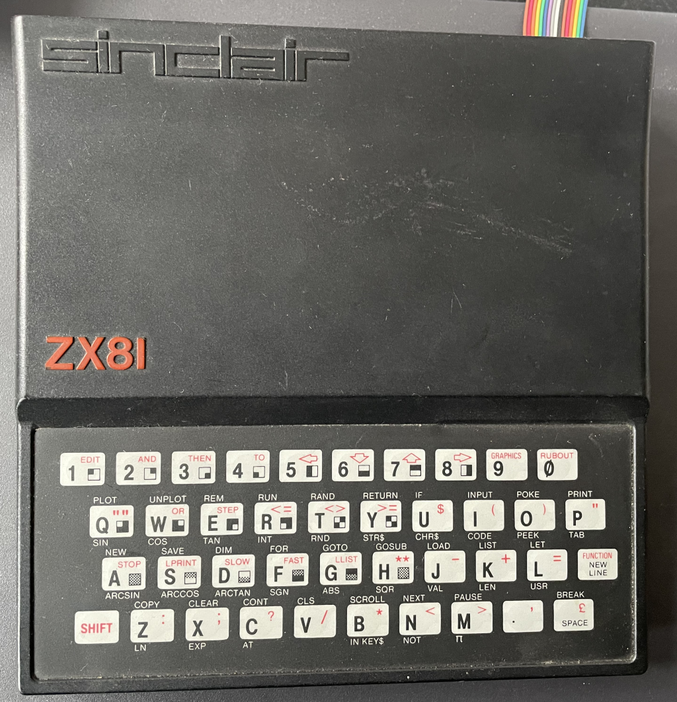

Hallo!

Mein Name ist Oliver Kocks. Seit dem ersten Kontakt mit einem Sinclair ZX81 im Jahre 1982 gilt mein Interesse der Software-Entwicklung.

Nach den Anfängen der Homecomputer-Ära mit Assembler und Basic, ging es im Wirtschafts-Informatik Studium weiter mit Cobol, Pascal und C.

In den Jahren 1994 bis 2003 war ich selbstständig tätig mit der Erstellung und dem Vertrieb von Hard- und Software, ehe sich 2003 daraus die Gründung der NESOFT Datentechnik GmbH anschloss, dessen geschäftsführender Gesellschafter ich bis heute bin. 

Der Schwerpunkt war ein Softwarepaket für die Bereiche Arbeitssicherheit und Umweltschutz, entwickelt zuerst in Microsoft Foxpro + C, seit 2008 als Web-Anwendung mit C# und Asp.Net.

2018 beschloss ich eine neue Aufgabe zu suchen und arbeite seitdem als Software-Entwickler bei der Erstellung einer großen, platformübergreifenden Anwendung für die Messdatenanalyse mit. Meine Hauptaufgaben sind die Visualisierung der Daten mit OpenGL unter WPF/Xamarin/Maui, die Entwicklung grundlegender platformunabhängiger Gesamt-Strukturen und die Qualitätssicherung mit Testkonzepten, in Zukunft geplant in Anlehnung an die ISO 29119.

 
 

  

